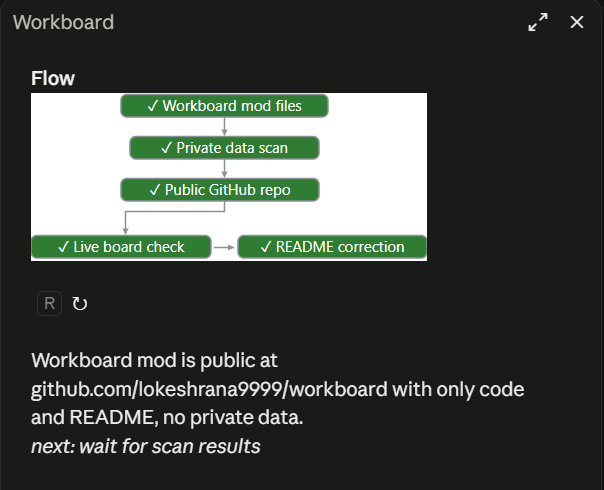

# workboard

A Claude Code mod: one live view of long-running work in a session.



It tracks each top-level subagent (started, tool calls, last activity, finished, failed), groups agents that run together into a batch for an ETA, notices test commands run through Bash or PowerShell, and reads context fill, plan limits and cost. Each surface shows a different slice of that.

## surfaces

| Surface | What it shows |
|---|---|
| `/board` pane | A flow diagram of the job, a ↻ button that reruns it now, and a short summary of where things stand. |
| Band above the prompt | Only while agents run and the pane is closed: agents done out of total, failures, ETA, elapsed time, and on wide terminals context % and the last test result. |
| `open_board` tool | Claude calls it when asked for status. It opens the pane and returns the full board as text to Claude: agents, main turn, tests, context, plan limits and cost. |

Plan limits and cost appear only in the tool's text, since the status line already shows them.

The flow diagram comes from a Sonnet call and the summary from a Haiku call. Both run only while the pane is open, are rate limited, and are skipped when nothing changed. `hooks/flow.ts` draws the diagram as Raster cells in the terminal, SVG in the desktop app, or ASCII elsewhere.

State lives in `$.state`, so a hot reload keeps agents, the batch, the flow and the summary.

## install

Clone the repo, then point Claude Code at it with the `CLAUDE_CODE_PLUGIN_DIRS` environment variable, for example in `~/.claude/settings.json`:

```json
{
  "env": { "CLAUDE_CODE_PLUGIN_DIRS": "/path/to/workboard" }
}
```

## layout

| Path | Role |
|---|---|
| `.claude-plugin/plugin.json` | Manifest |
| `hooks/hooks.json` | Lists the hook modules to load |
| `hooks/register.tsx` | Main module: events, state, pane, band and tool |
| `hooks/flow.ts` | Parses and lays out the flow diagram |
| `types/index.d.ts` | Types for the mod's saved state |
| `tests/board.test.ts` | Tests |
| `docs/board.png` | Screenshot used in this README |

`.claude-plugin/types/` is generated by Claude Code and is not committed.
